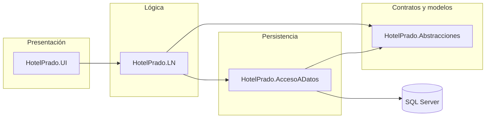

<div align="center">

# Hotel Prado — Inn Suites

### Sistema web de gestión hotelera

*Reservas, habitaciones, apartamentos, clientes y operación diaria en un solo lugar.*

[](https://dotnet.microsoft.com/)
[](https://dotnet.microsoft.com/apps/aspnet)
[](https://learn.microsoft.com/ef/ef6/)
[](https://www.microsoft.com/sql-server)

[**Ver en GitHub**](https://github.com/EmmaCR03/HotelPradoInnSuites) · [**Clonar**](#-clonar-el-repositorio) · [**Ejecutar local**](#-ejecución-en-local)

</div>

---

## Tabla de contenidos

1. [Descripción](#-descripción)
2. [Características principales](#-características-principales)
3. [Arquitectura](#-arquitectura)
4. [Tecnologías](#-stack-tecnológico)
5. [Estructura del repositorio](#-estructura-del-repositorio)
6. [Requisitos](#-requisitos-previos)
7. [Instalación y ejecución](#-instalación-y-ejecución)
8. [Base de datos](#-base-de-datos)
9. [Configuración y seguridad](#️-configuración-y-seguridad)
10. [Despliegue](#-despliegue)
11. [Documentación adicional](#-documentación-adicional)
12. [Autoría](#-autoría)

---

## Descripción

**Hotel Prado** es una aplicación **ASP.NET MVC** orientada a la operación del hotel **Prado Inn Suites**. Centraliza la información de **habitaciones y departamentos**, **reservas**, **clientes**, **check-in**, **mantenimiento**, **personal**, **citas** y módulos administrativos (configuración de banners, galerías, precios, etc.), con **autenticación y roles** mediante **ASP.NET Identity** y **OWIN**.

El código sigue una **arquitectura en capas** (presentación, lógica de negocio, acceso a datos y abstracciones) para mantener el dominio ordenado y facilitar el mantenimiento.

---

## Características principales

| Área | Qué incluye |
|------|-------------|
| **Público / inicio** | Páginas de inicio, servicios, contacto, registro y acceso adaptados al sitio del hotel. |
| **Reservas** | Flujo de reservas para usuarios y vistas administrativas (lista de espera, solicitudes, edición). |
| **Inventario** | Habitaciones y departamentos: CRUD, imágenes, disponibilidad, calendario y estado. |
| **Clientes** | Listado, detalle e historial vinculado al negocio del hotel. |
| **Check-in** | Registro de llegadas y material relacionado (p. ej. tarjetas). |
| **Operaciones** | Mantenimiento, citas, colaboradores, solicitudes de limpieza, bitácora de eventos. |
| **Facturación / cargos** | Gestión de cargos y piezas asociadas a facturación según el modelo del proyecto. |
| **Administración** | Panel con configuraciones (hero banners, galerías, precios por departamento, etc.). |
| **Cuentas** | Login, registro, perfil (Manage), roles y vinculación cliente–usuario donde aplique. |

---

## Arquitectura

Flujo de dependencias entre capas (de afuera hacia adentro):



- **`HotelPrado.UI`**: controladores, vistas Razor, bundles, identidad y configuración web.
- **`HotelPrado.LN`**: reglas de negocio y orquestación.
- **`HotelPrado.AccesoADatos`**: Entity Framework, contexto y repositorios/consultas.
- **`HotelPrado.Abstracciones`**: interfaces, DTOs y modelos compartidos.
- **`DB`**: proyecto de base de datos (scripts / esquema en la solución).

---

## Stack tecnológico

| Categoría | Detalle |
|-----------|---------|
| **Runtime** | .NET Framework **4.8.1** |
| **Web** | **ASP.NET MVC**, Razor, IIS / IIS Express |
| **ORM** | **Entity Framework 6.x** |
| **Autenticación** | **ASP.NET Identity 2.x**, **OWIN** (cookies, OAuth donde esté configurado) |
| **Datos** | **Microsoft SQL Server** |
| **Frontend** | HTML, CSS, JavaScript, Bootstrap (según vistas y bundles del proyecto) |
| **JSON** | Newtonsoft.Json |
| **Herramientas** | Visual Studio, Git, opcionalmente **GitHub CLI** (`gh`) |

---

## Estructura del repositorio

```
HotelPradoInnSuites/
├── Proyecto-Prado/
│   ├── HotelPrado.UI/           → Aplicación MVC (punto de entrada web)
│   ├── HotelPrado.LN/           → Lógica de negocio
│   ├── HotelPrado.AccesoADatos/ → Acceso a datos (EF)
│   ├── HotelPrado.Abstracciones/→ Interfaces y modelos
│   ├── DB/                      → Scripts y proyecto de BD
│   ├── HotelPrado.UI.sln      → Solución principal
│   └── …                      → Scripts SQL, utilidades Python/PowerShell, notas .md
├── README.md
└── .gitignore
```

> La carpeta local **`Proyecto-Prado/dbViejaHotel/`** está **excluida del repositorio** (`.gitignore`) por ser datos legacy muy pesados; no forma parte del clon.

---

## Requisitos previos

- **Windows** (recomendado para el stack clásico de .NET Framework).
- **Visual Studio 2019/2022** con la carga de trabajo **ASP.NET y desarrollo web**.
- **SQL Server** (instancia completa o **LocalDB**).
- **Git** para clonar y versionar.

---

## Instalación y ejecución

### 1. Clonar el repositorio

```bash
git clone https://github.com/EmmaCR03/HotelPradoInnSuites.git
cd HotelPradoInnSuites
```

### 2. Abrir la solución

Abre el archivo:

`Proyecto-Prado/HotelPrado.UI.sln`

### 3. Restaurar dependencias

En Visual Studio: clic derecho en la solución → **Restaurar paquetes NuGet** (o compilar una vez; NuGet suele restaurar solo).

### 4. Cadena de conexión

Edita **`HotelPrado.UI/Web.config`** y configura la conexión a tu instancia de SQL Server (nombre del servidor, base de datos, autenticación).

### 5. Base de datos

Asegúrate de que la base exista y coincida con el esquema esperado (véase la siguiente sección).

### 6. Ejecutar

Establece **`HotelPrado.UI`** como proyecto de inicio y pulsa **F5** (IIS Express).

---

## Base de datos

- En **`Proyecto-Prado/DB/`** encontrarás el proyecto de base de datos y scripts en **`dbo/Tables/`** y **`Scripts/`** útiles para crear o ajustar tablas, índices y datos de configuración.
- El acceso desde código usa **Entity Framework** a través de **`HotelPrado.AccesoADatos`** y el contexto configurado en el proyecto.

Si migrás desde otro sistema, revisá también los **`.md`** y **`.sql`** en la raíz de `Proyecto-Prado` (notas de migración y verificación).

---

## Configuración y seguridad

- **No subas a un repo público** cadenas de conexión con contraseñas reales, claves SMTP, API keys ni secretos. Usá valores locales o archivos de ejemplo (como `Web.config.Produccion.Ejemplo` / `Web.config.email.example` si los tenés en el proyecto).
- En **producción**, usá **transformaciones de Web.config** (`Web.Release.config`) o **secretos del hosting** según tu proveedor.
- Revisá permisos de **roles** (ASP.NET Identity) para separar bien administración y clientes.

---

## Despliegue

- Publicá desde Visual Studio (**Publicar**) o generá el paquete y subilo a tu hosting (**IIS**, **SmarterASP**, **cPanel**, etc.) según tu entorno.
- En el repo hay documentación auxiliar (`GUIA_DESPLIEGUE_*.md`, checklists, etc.) en **`Proyecto-Prado/`** para referencia operativa.

---

## Documentación adicional

Dentro de **`Proyecto-Prado/`** hay muchos archivos **`.md`** con guías (red local, hosting, migración, optimización móvil, etc.). Sirven como **anexo operativo**; el núcleo del producto es la solución **`.sln`** y los proyectos **HotelPrado.\***.

---

## Autoría

Proyecto desarrollado para **Prado Inn Suites**.

Repositorio principal: **[github.com/EmmaCR03/HotelPradoInnSuites](https://github.com/EmmaCR03/HotelPradoInnSuites)**

---

<div align="center">

**Hotel Prado** · *Inn Suites*

Hecho con dedicación para la operación diaria del hotel.

</div>
